# Welcome

**The Human Edge: Using and Delivering AI with Judgement**

A one-day masterclass · Curtin Executive Education

:::: {.notes}
- Welcome everyone. Today is about *doing*, not just listening.
- One idea, applied at two scales: at your desk in the morning, across a project in the afternoon.
- The one idea: AI produces a convincing average. Knowing when to trust it, and where *you* must stay in charge, is the skill that lasts. Tools don't; judgement does.
- Bring your device. You'll work on your own tasks and on a real project scenario.
- Ground rule: no stupid questions. The technology is new and everyone is figuring it out.
::::

---

# The provocation we'll spend the day on

> If the AI is genuinely good at running your work, it's equally good at running everyone else's.
> Generic competence, with no variation, is the baseline — not an advantage.

**So where does *your* edge actually live?**

:::: {.notes}
- Hold this question. We'll come back to it at the end of every session.
- The answer the day builds toward: your edge lives in your judgement, your taste, and the variation a rival's identical model can't reproduce.
- Everything today — from your first prompt to a project go/no-go — is in service of *locating and protecting* that edge.
::::

---

# Today's journey

**One idea. Two scales. One day.**

| Time | What we do |
|---|---|
| 9:00–10:30 | **The average, the tool, the edge** — foundations + the trust tool *(taught once)* |
| 11:00–12:30 | **Using AI well, yourself** — task scale: prompting, workflow redesign |
| 1:15–2:30 | **Why AI delivery is different** — project scale: the five differences |
| 3:00–4:00 | **Designing the human in, then shipping** — checkpoints, roadmap, go/no-go |
| 4:00–4:30 | **The edge that's left to humans** + your action plan |

:::: {.notes}
- The trust tool is the connective tissue. We learn it once this morning at the level of a single task ("do I trust this output?"), and we reuse it this afternoon at the level of a whole project ("where does a human stay in the loop?").
- Same grid, two scales. That's why this works as one coherent day rather than two crammed together.
- The morning builds the fluency; the afternoon applies it to delivery.
::::

---

# PART I — MORNING {.part}

## The average, the tool, and your edge

:::: {.notes}
- Part one is personal fluency. By lunch you'll have directed AI at your own work, judged how far to trust the output, and redesigned one real workflow.
::::

---

# What AI actually is

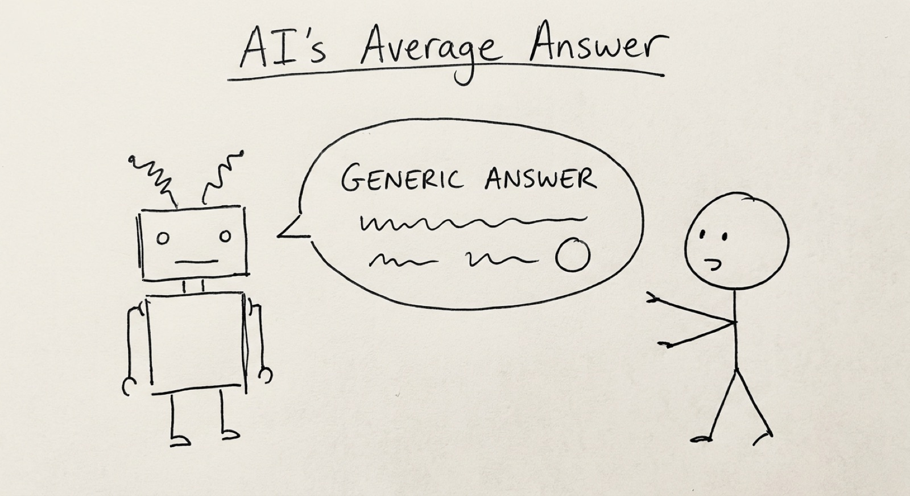{fig-align="center"}

**It predicts the next word.** Autocomplete, scaled up.

::::: {.notes}
- Trained on billions of pages of text, it learned what tends to follow what. It's autocomplete on steroids — your phone predicts one word; these predict thousands.
- The result often *looks* like understanding. It's pattern-matching, not reasoning.
- You don't need the maths. You need an honest mental model: what the tool can and can't do.
- Driving a car well doesn't require knowing how the engine works — but you do need to know it needs fuel and won't go underwater.
:::::

---

# The one mental model to keep

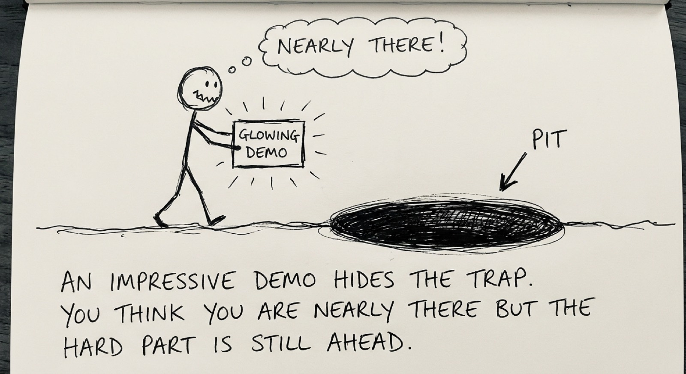{fig-align="center"}

> AI produces a **convincing average** drawn from everything it has seen.

**An average, not a truth.** It predicts; it does not reason.

::::: {.notes}
- That average is often genuinely excellent — the average of a vast amount of competent writing is itself competent.
- But "about right" and "exactly right" are not the same. It predicts; it does not reason, and it does not "know."
- This single distinction carries the whole day. If you remember nothing else: it produces a convincing average, and a convincing average is not the same as the truth.
- Everything that follows — the trust tool, prompting, the five differences, the human-in-the-loop design — is an elaboration of this one fact.
:::::

---

# Why it's brilliant at some things

**Tasks where "the most plausible version" is exactly what you want:**

- ✅ Drafting and writing
- ✅ Summarising documents
- ✅ Formatting and transforming
- ✅ Brainstorming
- ✅ Explaining concepts in simpler terms
- ✅ Finding patterns in data

:::: {.notes}
- If a task has clear patterns, AI can probably help. There are billions of email examples, summaries, and explanations in the training data.
::::

---

# …and quietly unreliable at others

**Tasks that need a single correct answer:**

- ❌ Factual accuracy (plausible text, not verified truth)
- ❌ Precise figures and calculations
- ❌ Multi-step logical reasoning
- ❌ *Your* context — it doesn't know your company, team, or politics
- ❌ Ethical judgement

:::: {.notes}
- The critical point: AI never says "I don't know." It gives you a confident, well-structured, completely wrong answer — and it looks identical to a right one.
- Nothing in the tone warns you. That's the danger: not that it refuses to help, but that it helps convincingly when it shouldn't.
::::

---

# "Confident nonsense" is not a bug

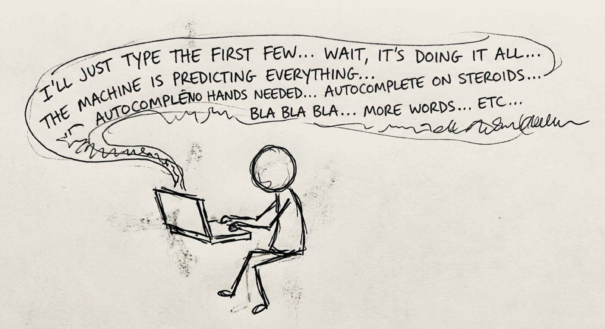{fig-align="center"}

Ask a colleague → *"I'm not sure, let me check."*
Ask AI → confident, well-structured, completely wrong.

::::: {.notes}
- Hallucination isn't a glitch. It's the same machinery working as designed — sometimes the most plausible-sounding continuation simply isn't true.
- If you take one thing from this morning: AI output needs human verification. Always — especially facts, numbers, names, quotes, and references.
- This isn't something a future model will "fix." It's a property of how the technology works.
:::::

---

# Framework 1: the trust tool

{fig-align="center"}

:::: {.notes}
- Two questions turn "can we just let the AI do this?" from a gut feel into a decision you can defend.
- This grid is the spine of the day. We use it at the task level this morning and the project level this afternoon.
::::

---

# Two questions, four corners

**Q1: do you need an *average*, or do you need *precision*?**

An *average* answer is "in the right ballpark" — a first draft, a summary, a starting point. A *precise* answer has one correct value: a contract figure, a dosage, a citation, an account balance.

**Q2: is the decision *small* or *large*?**

*Small* = low stakes, easy to reverse, no one harmed. *Large* = real consequences: money, safety, reputation, someone's job.

:::: {.notes}
- Walk through the grid:
  - Average + Small → lean in. AI's home turf.
  - Average + Large → lean in, but sanity-check before it goes out.
  - Precise + Small → use, then verify the specifics.
  - Precise + Large → human in the loop. AI may assist, but a person owns the decision.
- Rule of thumb: lean in where "about right" over low stakes is fine; keep a human in the loop where exactly-right meets high-stakes.
::::

---

# The trust tool, on real tasks

- **Drafting an internal email.** Average is fine, stakes small → lean in.
- **Board paper figures.** Precision required, stakes large → human owns every number.
- **Summarising fifty complaints to find themes.** Average is fine → lean in, then have a person skim for the one complaint the AI smoothed away.

:::: {.notes}
- Notice what the grid quietly does: it makes "where does a human stay in the loop?" an *answerable* question. Most teams answer it by gut — everywhere (lose speed) or nowhere (lose trust).
- Now you have a better answer than yes or no. You have a question — average or precise, small or large? — and the question does the work.
::::

---

# Exercise 1: the AI tool test drive

**Same task. Your tool of choice. Judge the result with the trust tool.**

:::: {.notes}
**Setup (2 min):**
- Pick a real, small task from your work — an email, a summary, a first draft of something you genuinely need.
- Run it through an AI tool.

**Do (8 min):**
- Look at the output. Where on the trust tool grid does this task sit?
- Is the output "about right" or does it need exactness? Where would it be confidently wrong?

**Debrief (10 min):**
- Share one place the output was genuinely useful, and one place it was confidently off.
- Connect each to a corner of the grid.
- Key message: there's no objectively "best" tool. What matters is never assuming the first output is ready to use.
::::

---

# Morning tea — 10:30

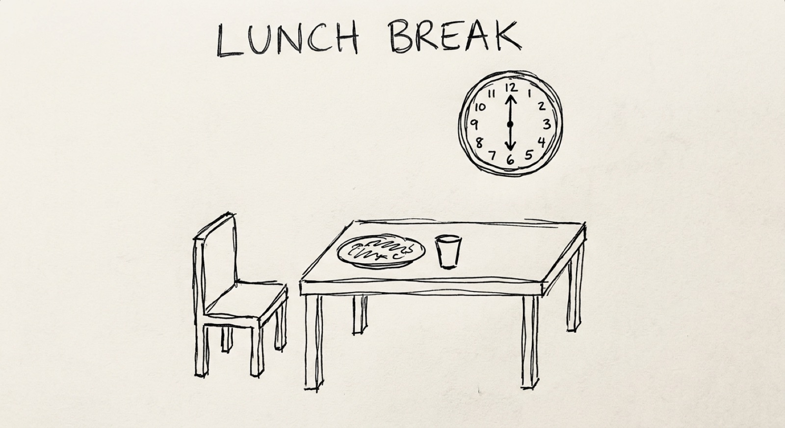{fig-align="center"}

::::: {.notes}
- 30-minute break. Encourage people to bring a real task to mind for the RTCF exercise after tea.
:::::

---

# Framework 2: RTCF — talking to AI well

**The quality of your input decides the quality of your output.**

- **R** — Role (who should the AI be?)
- **T** — Task (what exactly should it do?)
- **C** — Context (what does it need to know?) — *where your edge enters*
- **F** — Format (how should the output look?)

**Role, Task and Format are scaffolding** — weaker or self-hosted models need it spelled out; a frontier model infers it from clear writing. **Context is the part that always matters** — it's the one thing only you supply.

::::: {.notes}
- Most people type vague prompts, get vague results, and blame the tool.
- Separate the two halves of RTCF:
  - **Scaffolding (Role, Task, Format):** mostly for weaker / self-hosted models that need the structure. A frontier model (Claude, GPT-4-class) follows plain, well-written instructions well — if you're good at briefing a human, you're most of the way there. Use the labels as a checklist, not a rigid template you must fill every time. Over-ritualising them can even make prompts worse.
  - **Context:** the one part that matters on *any* model, because it's the thing only you hold — your specifics, your edge. No model, however smart, can manufacture your context.
- So the durable skill isn't "master a prompt framework." It's the skill that already makes you good at instructing people: being clear about what you want, and supplying the context the receiver can't infer. RTCF just names the parts — and as models get smarter, the scaffolding fades, leaving exactly your judgement and context.
- Honest note for the self-hosted crowd: if you run smaller local models (Ollama etc.), RTCF's full structure earns its keep — that's where it pays off most.
:::::

---

# Before and after

**Without RTCF:**
> "Write an email about the project delay"

**With RTCF:**
> **Role:** Senior project manager, professional and empathetic
>
> **Task:** Write a client email explaining a 2-week delivery delay
>
> **Context:** Delay caused by a vendor integration. The client values transparency. New date: March 15.
>
> **Format:** Under 200 words. Acknowledge → explain → new date → recommit.

:::: {.notes}
- The difference is unusable vs. sendable.
- Context is where *your* edge enters: the specifics only you hold — the relationship, the history, the tone this client needs.
::::

---

# The two-pass demo: where your edge lives

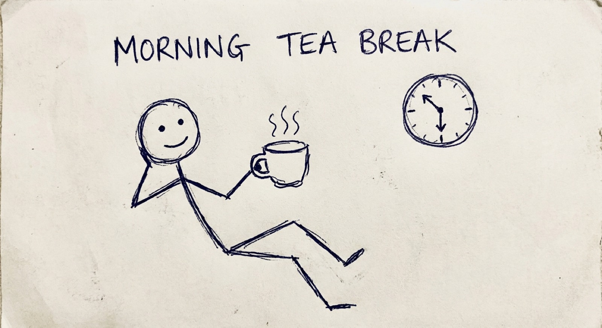{fig-align="center"}

**One task, run twice — live.**

> "This is good. Every one of you got this same good answer. So where's your edge?"

::::: {.notes}
- Run one real task twice, live (projector, follow-along optional).
- Pass 1 — generic: a naive prompt. The output is slick, correct, and *identical to what anyone in this room would get.* Point at it: "This is good. Every one of you got this same good answer. So where's your edge?"
- Pass 2 — with edge: layer in what only *you* hold — a customer only you've talked to, a contrarian bet, a taste call, domain knowledge the model lacks. Watch the output get a soul.
- This is the thesis, felt in the gut rather than heard as a quote. Pass 1 is the baseline (generic, anyone-could-have-it); Pass 2 is the edge (the variation the tool can't manufacture).
- Make it interactive — let the room shout the "edge" inputs.
- The lesson: the AI is your starting point, not your finish line. Your judgement, taste and relationships are what turn generic into *yours*.
- Go deeper (companion site): the "two-page voice method" makes this edge persistent — give the AI a writing sample, have it produce a style brief, paste it into custom instructions. Free tool: Style Mirror (stylemirror.eduserver.au), which can run locally. Caveat to land: the result is a "slight parody" of you — an average of your voice — so the residual edge stays yours.
:::::

---

# Exercise 2: redesign your workflow

**Pick one real task from your own role. Map it. Put AI where it helps.**

:::: {.notes}
**Do (20 min):**
1. Pick a task you do repeatedly — one you own.
2. List its steps.
3. For each step: where does it sit on the trust tool? Where does AI genuinely help, and where must your judgement stay in charge?
4. Redesign: let AI handle the average, low-stakes steps. Protect the precise, high-stakes ones.

**Debrief:**
- You leave with a redesigned workflow you can trial next week — AI at the steps where it adds value, you in charge where it counts.
- This is the morning's takeaway applied: not "use AI more," but "use AI *deliberately*, exactly where it belongs."
::::

---

# Morning recap: where we are

You now have:

- A mental model: AI produces a convincing average.
- **The trust tool** — average/precise × small/large.
- **RTCF** — how to direct AI well.
- A redesigned workflow from your own role.

**One question to carry into the afternoon:** *if this is how I trust AI on a single task, how do I trust it across a whole project?*

:::: {.notes}
- Bridge to the afternoon: the trust tool doesn't stop at your desk. It scales.
- This afternoon we lift the same grid to the project level — where the question becomes "where does a human stay in the loop across an entire AI initiative?"
- Same idea, bigger canvas.
::::

---

# Lunch — 12:30

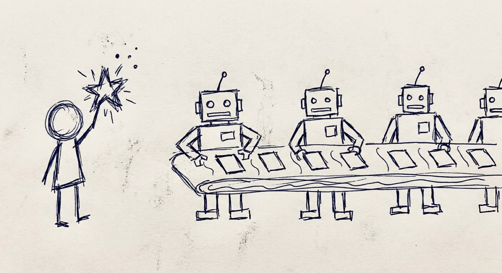{fig-align="center"}

::::: {.notes}
- 45-minute break. Over lunch, invite people to bring a real initiative to mind for the afternoon scoping work.
:::::

---

# PART II — AFTERNOON {.part}

## Why AI delivery is different

:::: {.notes}
- The afternoon is for anyone who will lead, scope, or contribute to an AI project.
- You're the delivery lead for one funded RetailFlow initiative. You'll carry it through to a go/no-go decision.
::::

---

# The fair question

> *I've delivered projects before. What's actually different about an AI project?*

Most of your instincts still serve you. Stakeholders, budgets, timelines, the awkward sponsor conversation — all carry over.

**But five things behave differently**, and each quietly breaks an assumption normal projects let you take for granted.

:::: {.notes}
- The honest reassurance: AI projects don't fail *more* often. They fail *differently*. The cracks appear in different places.
- If you don't adjust for the five, the project doesn't fail more — it fails in ways you didn't see coming.
::::

---

# The five differences

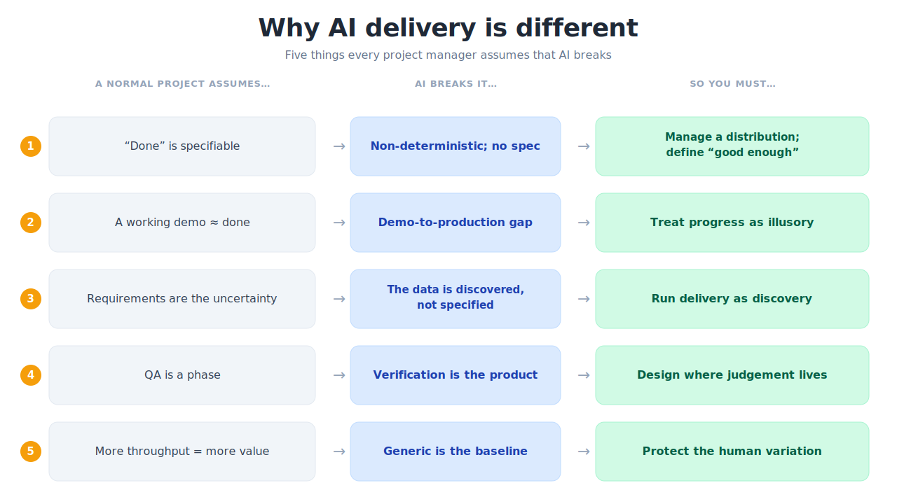{fig-align="center"}

:::: {.notes}
- Walk the table. For each: the assumption, why AI breaks it, the move good leaders make.
- The thread through all five: AI gives you something fluent and roughly-right, fast — then asks you to do the harder work of deciding when roughly-right is good enough, and who checks when it isn't. That's a leadership question, not a technical one.
::::

---

# Difference 1: "done" can't be specified
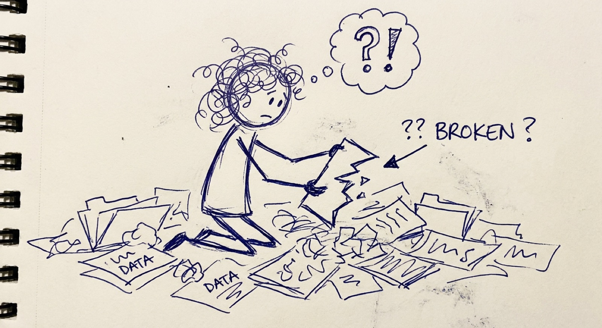{fig-align="center"}

| You normally assume | Why AI breaks it | The move |
|---|---|---|
| Write the requirement, check it was met. | AI is non-deterministic. Ask twice, get two answers. No single correct output — only a spread of likely ones. | Stop chasing a fixed "done." Manage a probability distribution. Decide up front what "good enough" looks like *for this use*. |

:::: {.notes}
- This is the trust tool at project scale: you can't tick a box, you have to set an acceptable band and monitor it.
::::

---

# Difference 2: the demo is a trap
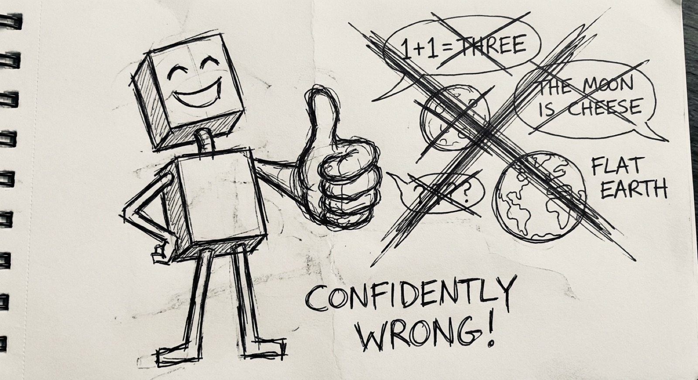{fig-align="center"}

| You normally assume | Why AI breaks it | The move |
|---|---|---|
| A working demo means we're nearly there. | The demo shows the happy path. The messy real-world cases are where it falls over. Progress feels real but is largely illusory. | Treat the demo as the *start* of the hard part, not the end. Refuse to let an impressive demo set the timeline. |

:::: {.notes}
- The gap between an impressive demonstration and a dependable production system is wide and deceptive.
- Sponsors see the demo and assume the rest is engineering. It isn't.
::::

---

# Difference 3: the data is the uncertainty
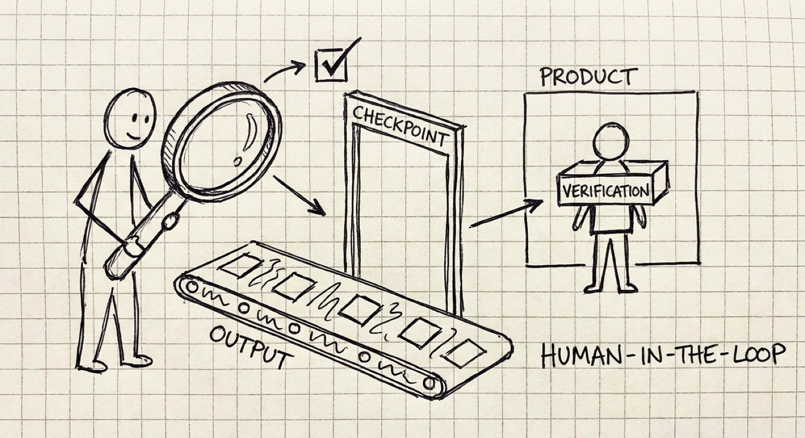{fig-align="center"}

| You normally assume | Why AI breaks it | The move |
|---|---|---|
| The data is a known input. We specify it, someone supplies it. | The data is *the* uncertainty. You discover what you actually have — its gaps, biases, surprises — only by working with it. | Run delivery as organisational discovery. Build the learning into the plan, don't treat it as slippage. |

:::: {.notes}
- On an ordinary project, data is something you order. On an AI project, data is something you find — and it's rarely what you expected.
::::

---

# Difference 4: verification is the product
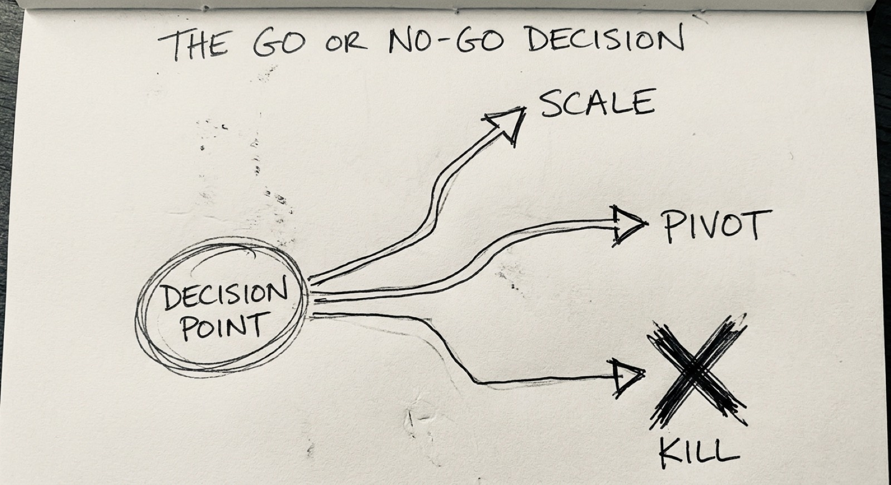{fig-align="center"}

| You normally assume | Why AI breaks it | The move |
|---|---|---|
| The build is the product. Ship the thing, you're finished. | With AI, outputs vary and can be confidently wrong. The value lives in how you check them, and where a human stays in the loop. | Design the checking deliberately. Make it part of what you ship, not an afterthought. |

:::: {.notes}
- This is the trust tool again: "where does a human stay in the loop?" is a *design decision*, not something to figure out after something goes wrong.
- The checkpoints *are* the product. A system without them is a demo.
::::

---

# Difference 5: generic competence is the baseline
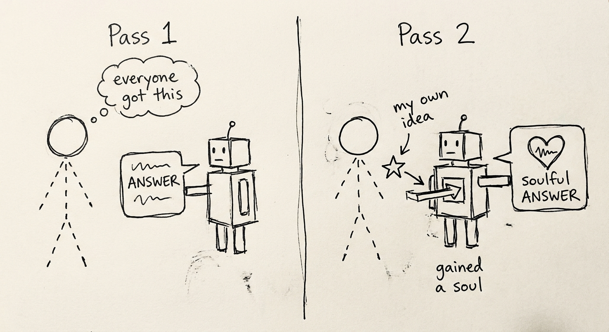{fig-align="center"}

| You normally assume | Why AI breaks it | The move |
|---|---|---|
| If we build something clever, that's our edge. | When every rival can run the same models, the model isn't your advantage — anyone can have it. | Compete on the human variation a rival's identical model can't reproduce: your taste, your judgement, how your people apply it. |

:::: {.notes}
- This is the morning's thesis, at organisational scale.
- The edge isn't the model. It's the judgement you design into the project — and the data, processes and people that are uniquely yours.
::::

---

# The thread through all five

> AI gives you something fluent, plausible, and *roughly* right, fast — then asks you to do the harder work of deciding when roughly-right is good enough, and who checks when it isn't.

That's a **leadership question**, not a technical one. Which is exactly why it lands on your desk.

:::: {.notes}
- Pause here. The five differences are not cause for alarm or hype. They just describe where the cracks appear.
- Every standard PM tool still applies — it just *bends* under these five forces. The afternoon is about learning the bend.
::::

---

# Your project: RetailFlow

You are the **delivery lead**. The board has funded one AI initiative at RetailFlow. Ship it without the predictable failures.

You'll carry one project through three moves, scoping and stress-testing it by **interviewing the RetailFlow team** — live AI chatbots who have opinions, disagree with each other, and won't do your job for you.

:::: {.notes}
- Each group takes a different initiative, so no two designs look alike.
- The bots are fluent and confident even when they don't know — exactly the AI behaviour you're learning to lead. Treat what they tell you with the same scrutiny as any AI output.
::::

---

# Sprint 1: scope it against reality

Interview **Priya** (Data) and **Marcus** (CIO). Reconcile "move fast" with "the data isn't ready."

→ **Scoped objectives, data requirements, and a defined "good enough."**

:::: {.notes}
- This is differences 1 and 3 in action: define "good enough" as a band, and treat data as discovery.
- Push back on both. Marcus wants speed; Priya wants realism. A good plan reconciles them — don't take either as gospel.
::::

---

# Afternoon tea — 2:30

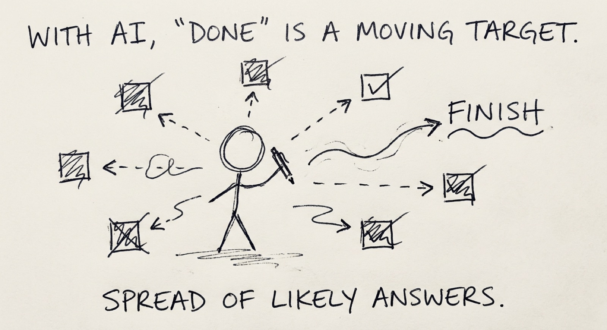{fig-align="center"}

::::: {.notes}
- 30-minute break. The final sprint after tea builds the roadmap and makes the go/no-go call — keep people anchored to their scoped project.
:::::

---

# Sprint 2: stakeholders & human-in-the-loop

Interview **Emma** (MD), **Tom** (Customer Service), and **David** (CFO). Decide where a human must stay in charge.

→ **A stakeholder plan and a human-in-the-loop checkpoint design.**

:::: {.notes}
- This is the trust tool and difference 4 in action: design the checking deliberately. Where does verification sit? Where must a person own the decision?
- The checkpoints are part of the product, not an afterthought.
::::

---

# Sprint 3: roadmap, risk & the go/no-go

Build the delivery roadmap with **go/no-go gates** and a risk register.

Then make the call: **Scale, Pivot, or Kill.**

:::: {.notes}
- The honest question at each gate isn't "is it perfect?" It's whether the evidence justifies continuing.
- Killing a project that isn't working, early, is success — not failure. The cost of wrongly scaling is far higher than the cost of wrongly killing.
::::

---

# The Scale / Pivot / Kill call

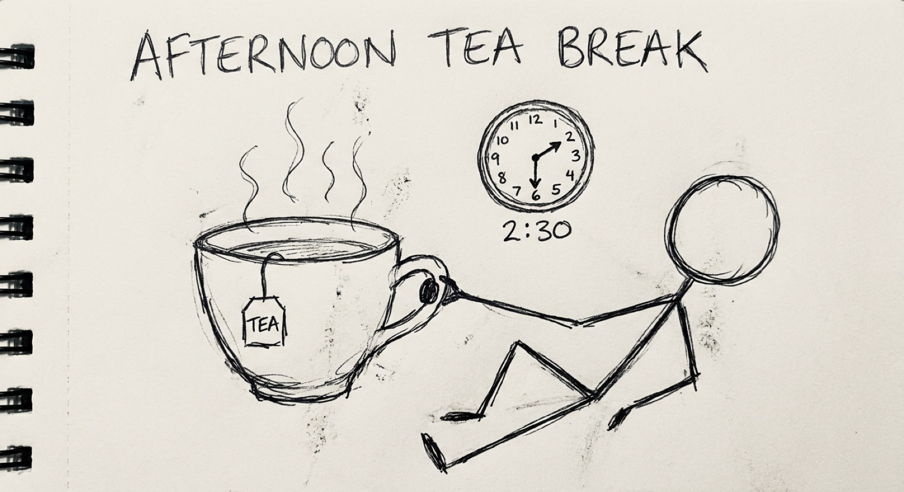{fig-align="center"}

- **Scale** — the evidence supports it.
- **Pivot** — right idea, wrong approach.
- **Kill** — it isn't working. *This is a good outcome.*

::::: {.notes}
- Scale: move toward production, with governance and monitoring that grow with the system.
- Pivot: change the shape, keep the intent.
- Kill: stop early, before it consumes more budget and goodwill. Normalise killing — a portfolio that never kills can't learn.
- The honest question at each gate isn't "is it perfect?" It's whether the evidence justifies continuing. The cost of wrongly scaling is far higher than wrongly killing.
- Frame killing to your sponsor as disciplined decision-making under uncertainty, not failure.
:::::

---

# What you've built by 4:00

A **delivery design for a real AI project**, not a theory to apply later:

- Scoped objectives, data requirements, and a defined "good enough"
- A delivery roadmap with milestones and go/no-go gates
- A stakeholder plan and a human-in-the-loop checkpoint design
- A risk register and a Scale/Pivot/Kill decision you can defend

:::: {.notes}
- Pause. Look at what the trust tool — learned once this morning — became by the afternoon: a whole project's human-in-the-loop architecture.
- Same grid. Two scales. One coherent day.
::::

---

# PART III — CLOSE {.part}

## The edge that's left to humans

:::: {.notes}
- We close where we opened: the provocation.
::::

---

# Back to the provocation
{fig-align="center"}

> If the AI is genuinely good at running your work, it's equally good at running everyone else's.
> Generic competence, with no variation, is the baseline — not an advantage.

So where does your edge live?

:::: {.notes}
- You've spent the day answering this — at your desk and across a project.
- The answer is the same at both scales: your edge lives in the judgement the tool can't supply.
::::

---

# Where the edge lives

- **At the task:** knowing what to ask for, what to keep, what to throw away. (RTCF, the trust tool.)
- **At the workflow:** deciding where AI handles the average and your thinking stays in charge. (Your redesigned process.)
- **At the project:** designing the human in, defining "good enough," making the go/no-go call. (Your delivery design.)

**The AI is your starting point, not your finish line.** What turns generic into *yours* is the judgement, taste, and variation only you bring.

:::: {.notes}
- The variation matters precisely because the model produces an average. Averages converge. Variation diverges. Divergence — your taste, your contrarian calls, your specific customers — is where competitive edge survives.
- This is why hollowing out your team's expertise for short-term speed is a strategic error, not just an ethical one. You're deleting the only edge you have.
::::

---

# Your action plan

**This week.** Trial your redesigned workflow. Run one task through the trust tool before you act on it.

**This month.** Apply RTCF until it's habit. Start one conversation at work about where a human must stay in the loop.

**This quarter.** Scope one real AI initiative using what you built this afternoon — objectives, "good enough," checkpoints, a go/no-go gate. Defend the Scale/Pivot/Kill call.

:::: {.notes}
- Make the commitments specific. Vague plans don't survive Monday.
- Trade plans with the person next to you — you'll check in with each other.
::::

---

# What you leave with

- **Reusable decision tools** — the trust tool, RTCF, the five differences, Scale/Pivot/Kill. Tool-agnostic; they don't expire when the next model ships.
- **A redesigned workflow** from your own role, ready to trial.
- **A project design** — scope, roadmap, checkpoints, risk — for a real scenario.
- **A personal action plan** for the week, month, and quarter.
- A free companion resource to go deeper: **michael-borck.github.io/conversation-not-delegation**

:::: {.notes}
- The frameworks are the durable part. The specific tools will change; the judgement won't.
- Thank everyone. Open the floor for questions.
::::
