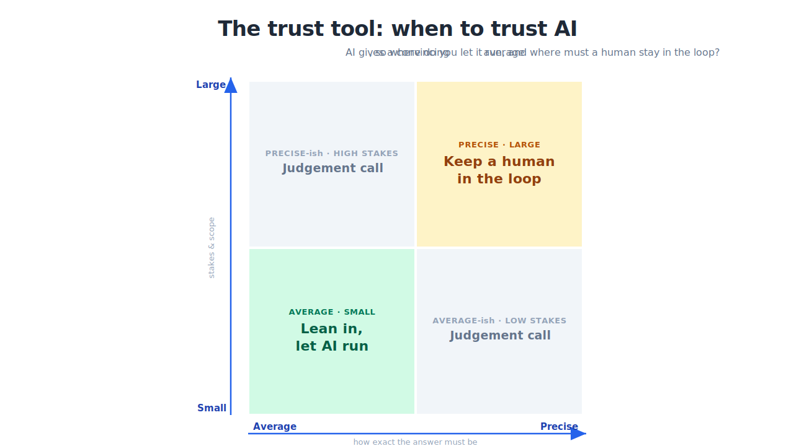

These are durable, tool-agnostic frameworks: they work regardless of which AI model you're using or which one comes out next quarter. They span both halves of the day — the task scale and the project scale.

## The trust tool: the spine of the day

The core lens: **Average / Precise × Small / Large.**

- AI excels at **average** answers over **small**, low-stakes work, so lean in.
- It gets dangerous on **precise** answers and **large**, high-stakes work, so keep a human in the loop.

You learn it in the morning at the level of a single task ("do I trust this output?"). You reuse it in the afternoon at the level of a whole project ("where does a human stay in the loop?"). It comes from the free companion book, [*Conversation, Not Delegation*](https://michael-borck.github.io/conversation-not-delegation/).

{fig-align="center"}

## RTCF: directing AI well

**R**ole · **T**ask · **C**ontext · **F**ormat. Not every prompt needs all four, but for anything important they transform the result. Context is where *your* edge enters: the specifics only you hold.

## Make your edge persistent: the two-page voice method

RTCF injects your edge one prompt at a time. To make it *stick*, give the AI a sample of your writing, have it write a two-page style brief, and paste that into your custom instructions. [**Style Mirror**](https://stylemirror.eduserver.au) (free, in-browser, can run on a local model) does the extraction. The result is a "slight parody" of you — an average of your voice — so the part that's still irreducibly *yours* gets easier to see. Full method on the [take-home page below](#handouts).

## The five differences: why AI delivery breaks the rules

"Done" can't be specified · the demo is a trap · the data is the uncertainty · verification is the product · generic competence is the baseline. Standard PM tools still apply — they just *bend* under these five forces.

## Scale / Pivot / Kill: the go/no-go call

At each gate, the honest question isn't "is it perfect?" It's whether the evidence justifies continuing. **Killing a project that isn't working, early, is success, not failure.**

## Take-home references

:::: {#handouts}
::::
